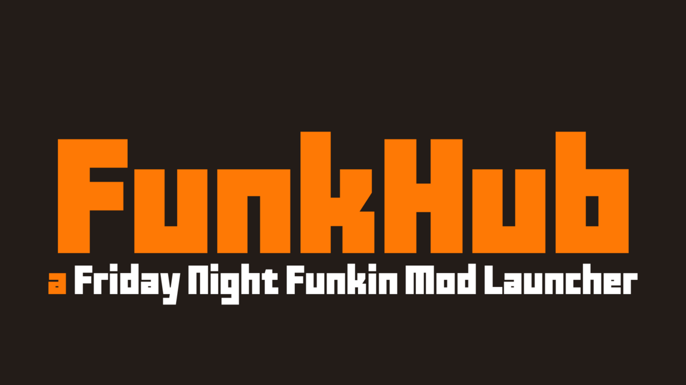
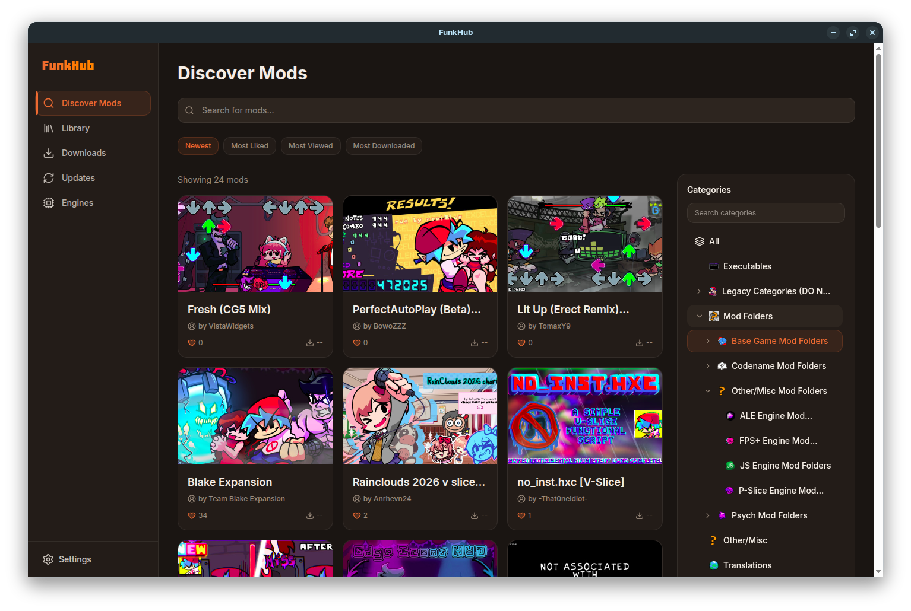
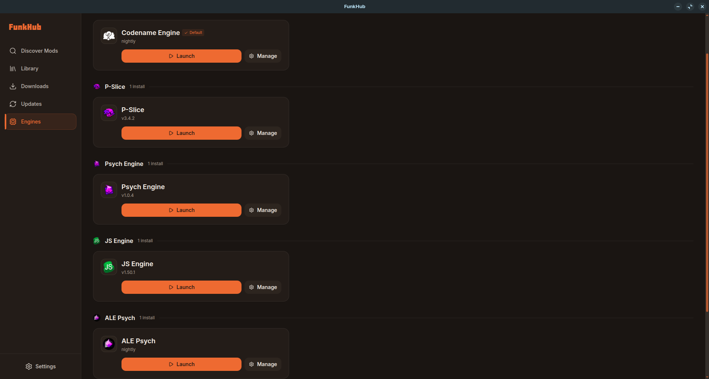
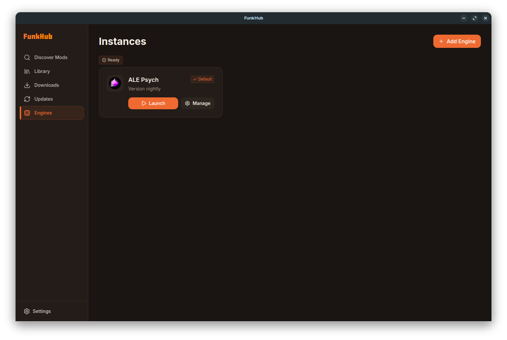

# FunkHub

<p align="center">
  
</p>

**A Friday Night Funkin' Mod Launcher**

[](https://github.com/Crew-Awesome/FunkHub/actions/workflows/build.yml)
[](https://github.com/Crew-Awesome/FunkHub/actions/workflows/release.yml)
[](https://github.com/Crew-Awesome/FunkHub/releases/latest)
[](https://spdx.org/licenses/GPL-3.0-only.html)

FunkHub is a desktop app for finding, installing, and launching Friday Night Funkin' mods.
Fast to navigate, easy to use, and built around the GameBanana API.

## Community

- Discord: https://discord.gg/cdP7JhDv4u

## Help Translate FunkHub

<p align="center">
  <a href="https://funkhub-translations.duckdns.org/">
    
  </a>
</p>

<p align="center">
  <strong>FunkHub needs your help to reach more players!</strong><br>
  We use <a href="https://funkhub-translations.duckdns.org/">Weblate</a> for community translations — no coding required.<br>
  If you speak another language, please consider contributing a translation!
</p>

<p align="center">
  <a href="https://funkhub-translations.duckdns.org/">
    
  </a>
</p>

## Features

### Discover & Install
- Browse mods and categories from GameBanana with full category tree navigation
- Search mods by name or browse by category/subcategory
- One-click installs via the `funkhub://` protocol from GameBanana mod pages
- Install standard zip/archive mods directly into engine mod folders
- Install standalone executable mod packages with cross-platform handling
- Retry or cancel in-progress downloads

### Library
- View all installed mods with screenshots, descriptions, and metadata
- Track **playtime per mod** — time is recorded while the mod is running
- Launch mods directly from the library (native, Wine, Wine64, or Proton)
- Stop a running mod from the UI
- Open a mod's install folder in the system file manager
- Update mods when newer versions are available on GameBanana
- Remove mods (with optional file deletion)
- Register manually installed mods that aren't from GameBanana
- Import existing mod folders from disk

### Engines
- Install engines directly from within the app
- Import an existing engine installation from a local folder
- Launch engines with configurable launcher (native / Wine / Wine64 / Proton)
- Stop a running engine from the engine card
- Engine health indicator (`ready`, `missing_binary`, `broken_install`)
- Custom names and icons per engine instance
- Open engine folder or mods folder in the file manager
- Update and uninstall engines
- Set a default engine for one-click installs

### Downloads
- Live download progress with speed, phase label, and byte totals
- Active, completed, and failed downloads displayed in separate sections
- Animated progress bar with shimmer while downloading, green on install
- Cancel active downloads; retry failed ones

### App Updater
- Checks for FunkHub updates on startup (configurable)
- Download and install app updates from within the app

### Localization
- UI available in English, Spanish (Latin America), Portuguese (Brazil), Russian, and Bahasa Indonesia
- Language selectable at runtime from Settings

## Supported Engines

| Engine | Slug |
|---|---|
| Psych Engine | `psych` |
| Base Game / V-Slice | `basegame` |
| Codename Engine | `codename` |
| FPS Plus | `fps-plus` |
| JS Engine | `js-engine` |
| ALE Psych | `ale-psych` |
| P-Slice | `p-slice` |


> **AI Disclosure:** This project includes AI-assisted work. OpenAI Codex and Anthropic Claude were used for bug fixing, UI improvements, and Weblate integration.

## Screenshots

<p align="center">
  
</p>

<p align="center">
  
</p>

<p align="center">
  
</p>

## Run Locally

```bash
bun install
bun run electron:dev
```

## Build

```bash
# Renderer only
bun run build

# Desktop packages
bun run build:desktop:linux:appimage   # AppImage (x64)
bun run build:desktop:linux:deb        # .deb (x64)
bun run build:desktop:linux            # AppImage + .deb (x64)
bun run build:desktop:win              # NSIS + portable (x64)
bun run build:desktop:mac              # DMG + ZIP
```

## Download Guide

Windows releases include two `.exe` files:

- `FunkHub Setup <version>.exe` — installer (recommended)
- `FunkHub <version>.exe` — portable, no install required

Release downloads: https://github.com/Crew-Awesome/FunkHub/releases

Nightly CI artifacts (14-day retention):

- https://nightly.link/Crew-Awesome/FunkHub/workflows/build.yml/main/FunkHub-linux-appimage.zip
- https://nightly.link/Crew-Awesome/FunkHub/workflows/build.yml/main/FunkHub-linux-deb.zip
- https://nightly.link/Crew-Awesome/FunkHub/workflows/build.yml/main/FunkHub-windows.zip
- https://nightly.link/Crew-Awesome/FunkHub/workflows/build.yml/main/FunkHub-macos.zip

## Contributing

- Read `CONTRIBUTING.md` before opening a PR.
- Please follow `CODE_OF_CONDUCT.md` in issues, PRs, and discussions.

## AI Tooling and Credits

- OpenAI Codex - AI-assisted bug fixing, UI support, and engineering workflow help
- Anthropic Claude - AI-assisted bug fixing, UI support, and Weblate integration support
- AI outputs are reviewed and integrated by project maintainers
