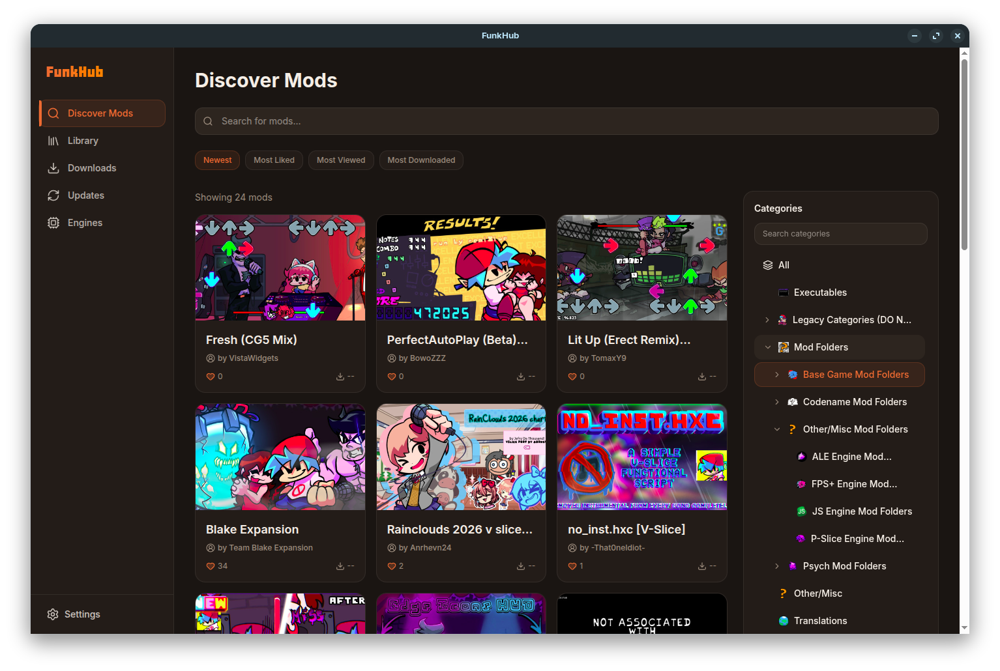
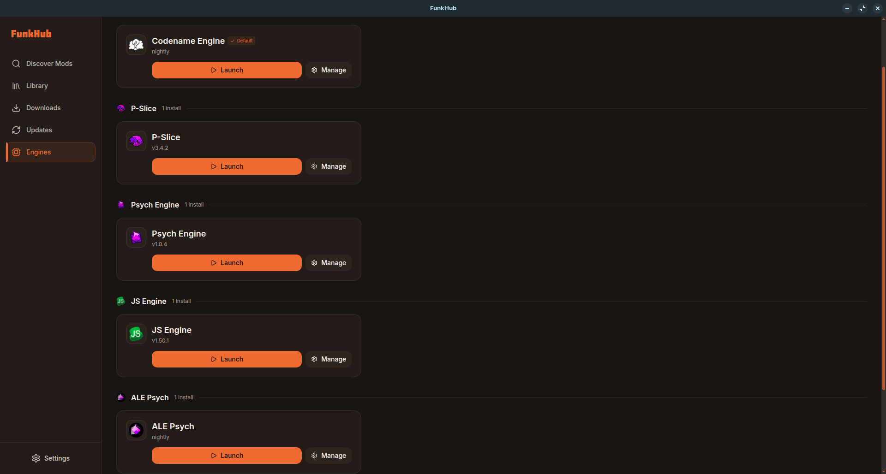
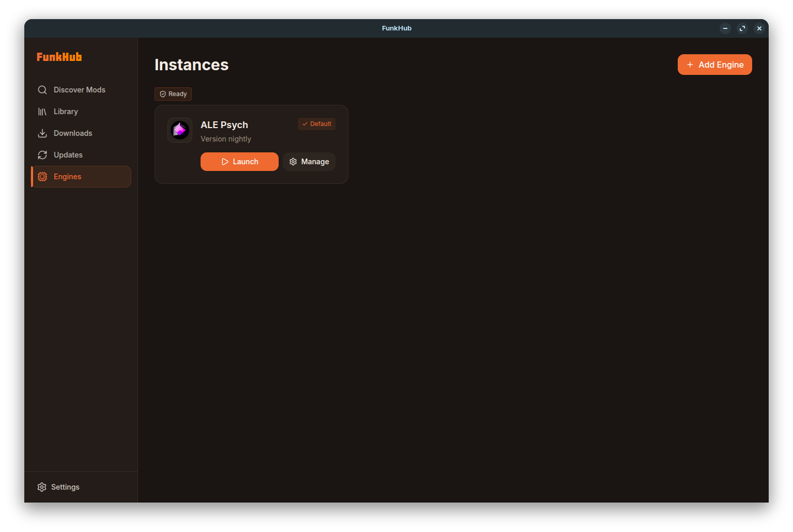

# FunkHub

FunkHub is a desktop app for Friday Night Funkin' mods.

## What You Can Do

- Browse mods
- Install mods
- Manage engines
- Launch mods from one place

## Get Updates

- GitHub Releases: https://github.com/Crew-Awesome/FunkHub/releases
- GameBanana: https://gamebanana.com/tools/22153

## Screenshots

